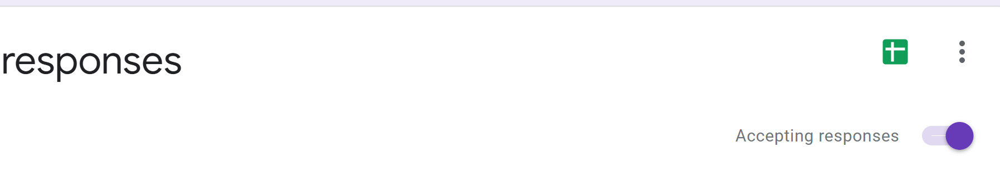
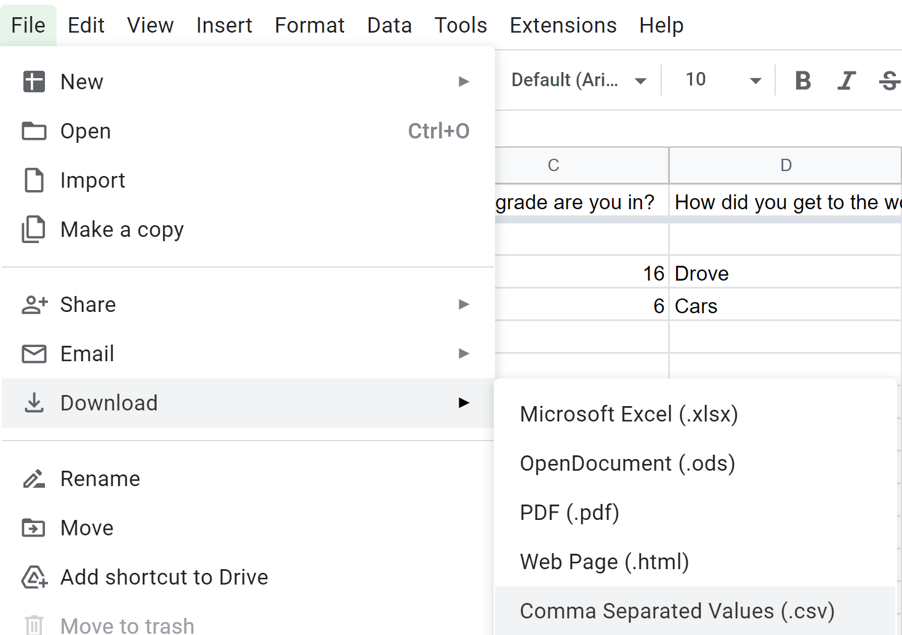
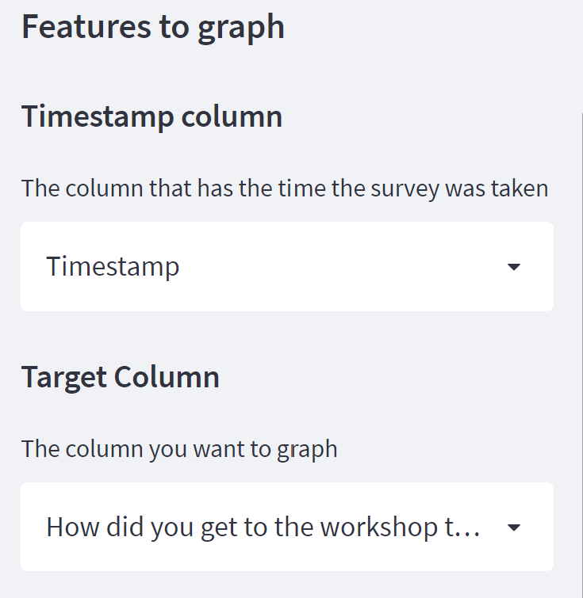
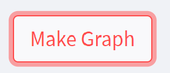

# Watsonville-Environmental-Science-Workshop-Survey-Visualizer
This project was created for the Watsonville Environmental Science Workshop to better visualize their exit survey results without needing experience in data analysis. 

This repo contains the source code for the deployed streamlit app that accepts a CSV file with a timestamp and generates tabulated visuals for each feature over a time frame. 

Link to app: https://share.streamlit.io/dblilienthal/watsonville-environmental-science-workshop-survey-visualizer/main/app.py

Link to workshop site: https://www.watsonvillescienceworkshop.com/

# Instructions on how to use

1. Go to <a href="https://share.streamlit.io/dblilienthal/watsonville-environmental-science-workshop-survey-visualizer/main/app.py"> this link </a>

2. Download your Google Sheets responses as a CSV file

 

3. Upload your downloaded CSV file into the website

4. Select the time column and the column you want to visualize

5. Select the time frame in which you want to see your results

6. Hit 'Make Graph'

7. Play with the parameters to adjust the way the graph looks

## Project Team
- [Derek Lilienthal](https://github.com/dblilienthal) / dblilienthal
- [Andrew Cline](https://github.com/andrew-m-cline) / andrew-m-cline
- [Kathryn Grose](https://github.com/katgrose) / katgrose
